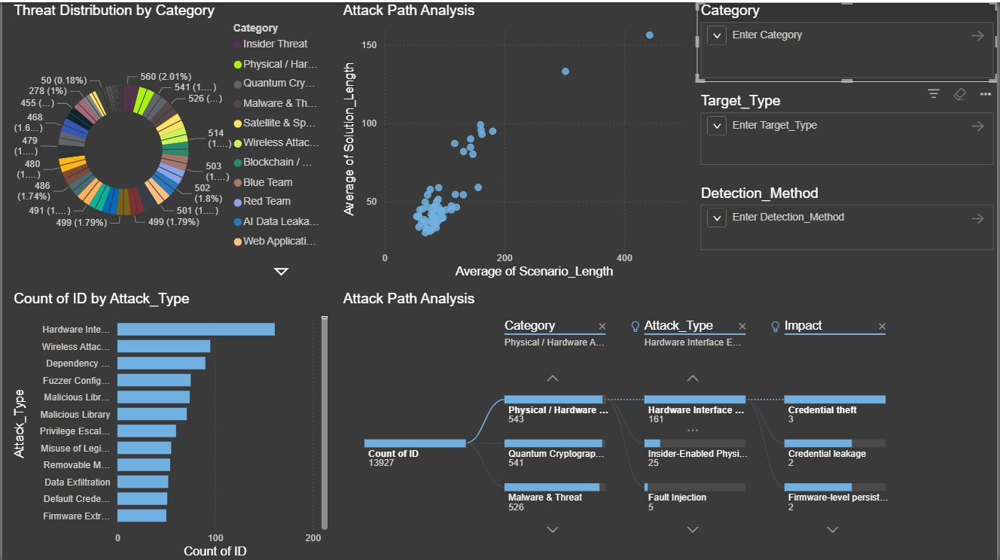

# 🔐 Cyber Security Threat Intelligence Project

## 📌 Project Overview

This project analyzes a cybersecurity attacks dataset to uncover patterns, trends, and risk insights across different attack types, countries, and impact levels.

**Objectives:**
- Identify the most frequent attack types
- Analyze attacks by country
- Evaluate impact severity
- Build interactive dashboards using Power BI

---

## 📊 Dataset Columns

- Attack_Type  
- Category  
- Target_Type  
- Vulnerability  
- Impact  
- Detection_Method  
- MITRE_Technique  
- Scenario_Description  
- Solution  
- Tags  
- Source  

---

## 🧹 Data Cleaning & Preparation

Performed using Python:
- Removed duplicates  
- Filled missing values with "Unknown"  
- Generated summary statistics  
- Created Scenario_Length and Solution_Length columns  

Libraries used: Pandas, Matplotlib, Seaborn, WordCloud  

---

## 📈 Exploratory Data Analysis (EDA)

Performed visualizations and analysis:

- Top Attack Types (Bar Chart)  
- Impact Distribution (Count Plot)  
- Scenario vs Solution lengths analysis (Histogram / Bar)  
- WordCloud for Scenario Descriptions  
- Heatmaps for Category / Attack_Type / Impact relationships  

### Top 5 Attack Types
| Top Attack Types | Count |
|---|---|
| Hardware Interface Exploitation | 161 |
| Wireless Attacks (Advanced) | 95 |
| Dependency Confusion | 90 |
| Fuzzer Configuration | 75 |
| Malicious Libraries | 74 |

### Top 5 Categories
| Top Categories | Count |
|---|---|
| Insider Threat | 560 |
| Physical / Hardware Attacks | 543 |
| Quantum Cryptography & Post-Quantum Threats | 541 |
| Malware & Threat | 526 |
| Wireless Attacks (Advanced) | 514 |

---

## 📊 Power BI Dashboard

An interactive dashboard was created using **Power BI**.  

Dashboard includes:

- KPI Cards (Total Attacks, Unique Attack Types, High Impact Attacks)  
- Clustered Column Charts for Top Attack Types  
- Donut/Pie Charts for Impact Distribution  
- Map / Column Charts for Attacks by Country  
- Matrix for Attack_Type vs Impact  

---
## 💎 Project Structure
CyberSecurityProject/

├── cybersecurity_attacks.csv

├── analysis.ipynb

├── dashboard.png 

├── cybersecurity_attacks_Dashboard.pbix

├── Attack.xlsx

├── README.md

---

## 🎯 Key Insights

- Phishing and Malware are the most common attack types  
- Certain countries experience higher attack volumes  
- High impact incidents are often linked to credential theft  
- Impact severity varies significantly by attack category  

---

## 👩‍💻 Author

Esraa  
Data Analysis – Cyber Security Domain

